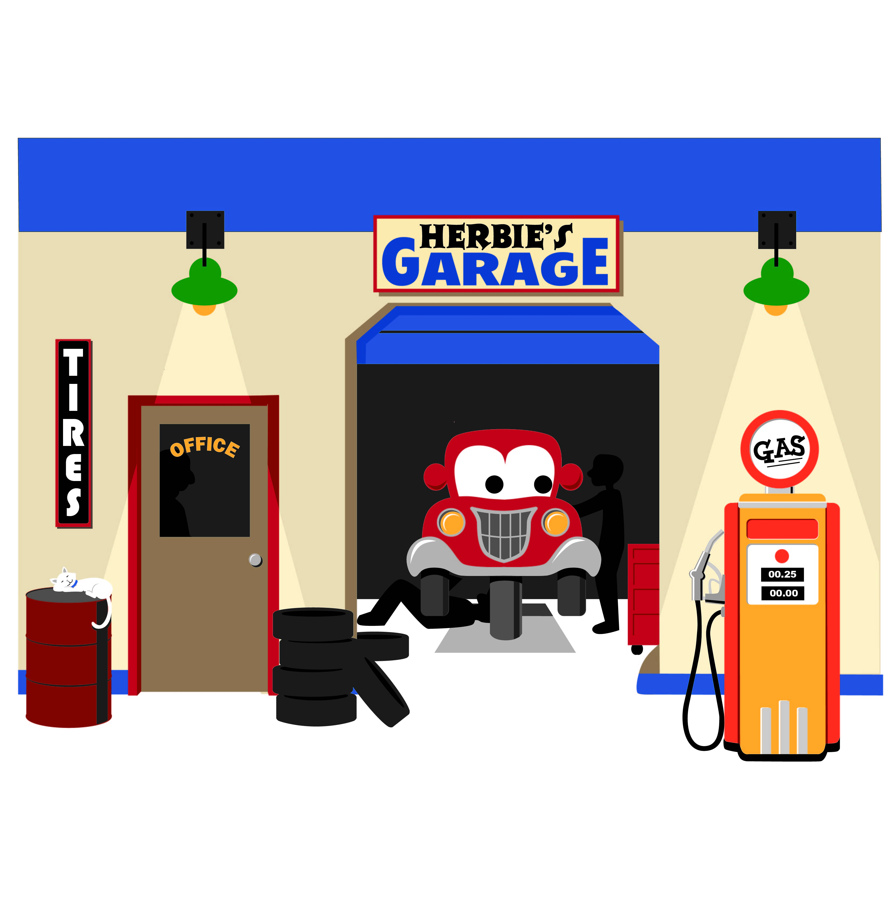

# CAR GARAGE MANAGEMENT
> My app help manage your car garage better! 

## Table of contents
* [General info](#general-info)
* [Screenshots](#screenshots)
* [Technologies](#technologies)
* [Code Examples](#Code-Examples)
* [Features](#features)
* [Status](#status)
* [Contact](#contact)

## General info
This is an application to manage tasks in a car garage. 
It is a subject project requirement, but we hope it will meet some practical requirements.

## Screenshots

## Technologies
* Tech 1 - SQL server 2012
* Tech 2 - C#

## Code Examples
Show examples of usage:
`put-your-code`

## Features
List of features:
* Receiving Vehicle Maintenance.
* Prepare a repair ticket.
* Look up the car.
* Make a receipt.
* Prepare monthly report.
* Change rules.

## Status
Project is building:
* 1/ Prepare readme.md
* 2/ Show 4-step to analysis project:

## Contact

Created by [@VietLThanh](https://www.facebook.com/thanhviet.loe)
and [@NguyenPhongTran](https://www.facebook.com/rickyta.0)
Work at: [UIT](https://www.uit.edu.vn/)

